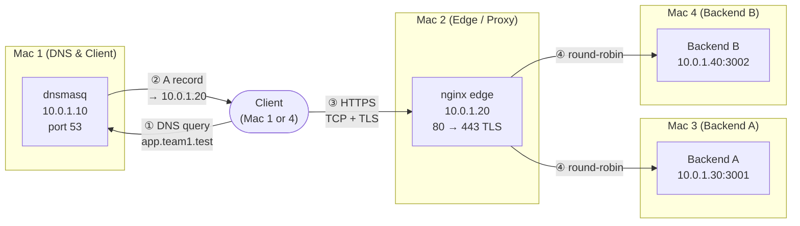

# Architecture Document — Private Network Service Platform

## 1. Topology

All 4 machines sit on the same private AWS VPC subnet `10.0.1.0/24`.

## 2. Machine roles and IP table

| Machine | Role | Private IPv4 | Represents |
|---|---|---|---|
| Mac 1 | Private DNS server + test client | 10.0.1.10 | Route 53 equivalent |
| Mac 2 | nginx edge reverse proxy + load balancer + TLS | 10.0.1.20 | Cloud LB / CDN edge |
| Mac 3 | Backend A, port 3001 | 10.0.1.30 | App server instance A |
| Mac 4 | Backend B, port 3002 + test client | 10.0.1.40 | App server instance B |

## 3. Domain
`app.team1.test` and `api.team1.test` both resolve to Mac 2 (`10.0.1.20`) via Mac 1's dnsmasq. 

## 4. Request-flow by protocol layer
| Step | Layer | What happens | Port |
|---|---|---|---|
| 1 | Application (DNS) | Client queries `app.team1.test` | UDP 53 → Mac 1 |
| 2 | Application (DNS) | Mac 1 answers with Mac 2's IP | UDP 53 |
| 3 | Transport (TCP) | Client ↔ Mac 2 three-way handshake (SYN/SYN-ACK/ACK) | TCP 443 |
| 4 | Session/Transport (TLS) | ClientHello → ServerHello → Certificate → Key Exchange → Finished | TCP 443 |
| 5 | Application (HTTP) | Encrypted `GET /api/status` request/response | TCP 443 |
| 6 | Load balancing | nginx proxies to Backend A or B, round-robin | TCP 3001/3002 |
| 7 | Application (HTTP) | Backend returns JSON + `X-Backend` + `Cache-Control` headers | — |
